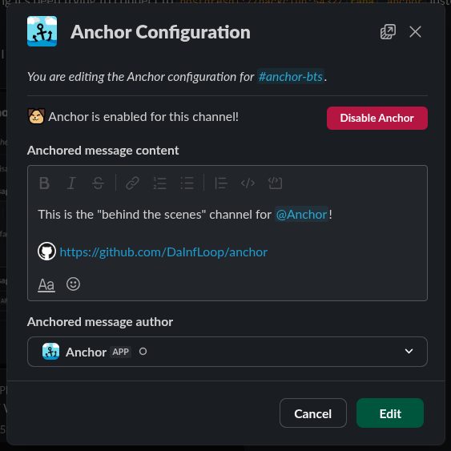

# Anchor
Anchor Slack messages to the bottom of a channel.

## Usage
1. Run `/anchor` in a channel that you have channel manager in or have created.
2. Edit the configuration how you please:



3. Save your changes and enable Anchor!

## Setup
### Prerequisites
1. Node.js (unsure what the minimum version required is, go figure)
2. TypeScript
3. Package manager (I use `pnpm`)
4. PostgreSQL

### Instructions
1. Clone the repo:
```sh
$ git clone https://github.com/DaInfLoop/anchor.git
```

2. Install dependencies:
```sh
$ pnpm i
```

3. Set up the required Postgres tables. You can use whatever interface you wish, but here are the `CREATE TABLE` statements:
```sql
CREATE TABLE config (
    channel_id varchar(255) PRIMARY KEY NOT NULL,
    enabled boolean NOT NULL,
    rich_text json NOT NULL,
    user_impersonate varchar(255) NOT NULL
);

CREATE TABLE last_anchored_message (
    channel_id varchar(255) REFERENCES config(channel_id) UNIQUE, 
    ts varchar(255)
);

CREATE TABLE warnings (
    channel_id varchar(255) UNIQUE, 
    large_channel boolean
);
```

4. Set up your `.env` file. A template is provided in `.env.example` and below.
```ini
NODE_ENV=development/production
PORT=3000

## Slack Bot creds
BOT_TOKEN="" # xoxb-...
APP_TOKEN="" # xapp-... (Socket Mode is used during development)
SIGNING_SECRET=""

## Slack User creds
XOXD="" # xoxd-... (grab this from your Browser cookies)
XOXC="" # xoxc-... (grab this from the Network tab of a request)

## ngrok creds
NGROK_TOKEN="" # or NONE to disable ngrok URL forwarding during development
NGROK_DOMAIN="" # optional, a static domain to forward on

## Postgres creds
PG_HOST=""
PG_USER=""
PG_DATABASE=""
PG_PASSWORD=""
```

5. Create an `/anchor` command and subscribe your Slack app to the `message.channels` and `message.groups` events.

6. You're done with setup! Run the `start` script however you please and start the bot!
```sh
$ pnpm start
```

## License
This repository is licensed under the MIT License. A copy of the license can be viewed at [LICENSE](/LICENSE).